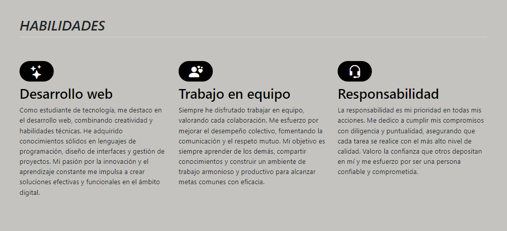

# Mi portafolio de habilidades TECNOLOCHICAS PRO

El presente proyecto es un portafolio desarrollado para poner en practica las habilidades ontenidos dentro del bootcamp de desarrollo fronted de Tecnolochicas PRO.

Fude desarrollado con HTML, CSS y JS con el uso de el framework de UI, Bootstrap utilizando ademas bibliotecas externas. 

La pagina es respondiba (adaptable a diferentes tamaños de pantalla) e incluye la presentacion de la autora del proyecto. 

[Proyecto desplegado](https://portafolio-alpha-fawn.vercel.app/)

## Secciones de mi sitio

## Tecnologías
* HTML
* CSS
* Bootstrap 
* Javascript
---
Desarrollado por [Cinthia](https://www.instagram.com/cn_cindy_16?igsh=M2E4Zzg4ZmZxYzll) en [TECHNOLOCHICAS PRO](https://tecnolochicas.mx/)

